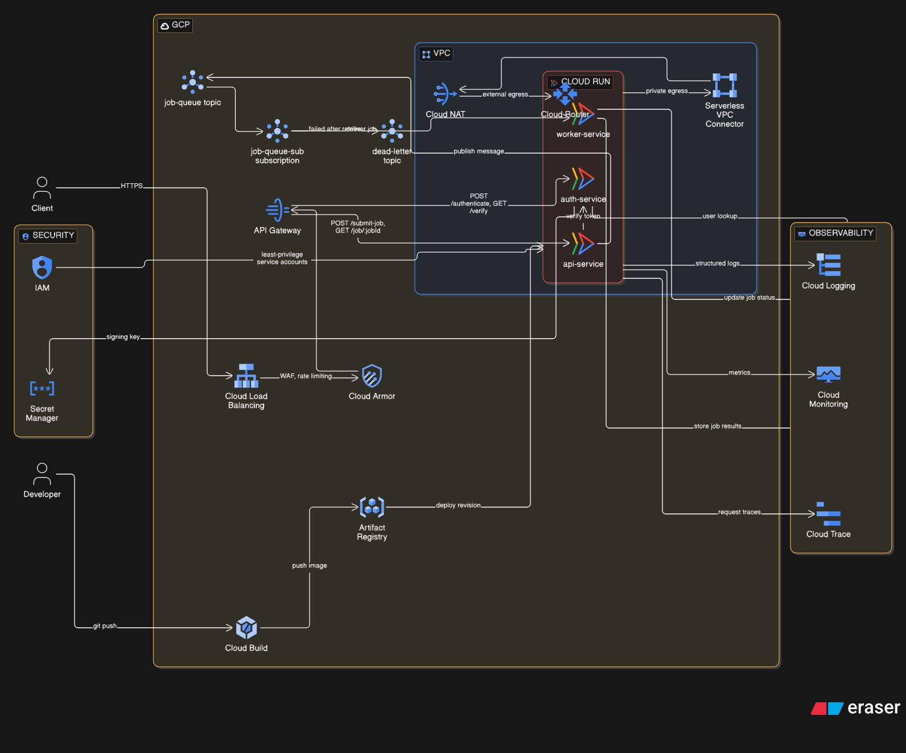

# GCP Multi-Service Architecture Lab

A microservices deployment on Google Cloud Platform demonstrating Cloud Run,
Pub/Sub, API Gateway, VPC networking, and IAM.

## Overview

Three Node.js services deployed on Cloud Run, communicating through Pub/Sub for
asynchronous job processing. An API Gateway fronts the services as a single
entry point, and Cloud Logging provides centralized observability.

## Services

| Service        | Role                                        | Endpoints                              |
|----------------|---------------------------------------------|----------------------------------------|
| auth-service   | Token generation and verification           | POST /authenticate, GET /verify        |
| api-service    | Job submission, publishes to Pub/Sub        | POST /submit-job, GET /job/:jobId      |
| worker-service | Consumes jobs from Pub/Sub, processes async | (subscriber, GET /health)              |

All services expose GET /health for Cloud Run health checks.

## Architecture



Client traffic enters through Cloud Load Balancing and Cloud Armor, then the API
Gateway routes to the Cloud Run services. The api-service publishes jobs to
Pub/Sub, which the worker-service consumes. Supporting layers cover CI/CD,
networking, security, and observability.

## Message Flow

1. Client authenticates via auth-service and receives a token.
2. Client submits a job to api-service, which publishes a message to the
   `job-queue` Pub/Sub topic and returns 202 Accepted with a job ID.
3. worker-service subscribes to `job-queue-sub`, processes the job, writes an
   entry to Cloud Logging, and acknowledges the message.

## Infrastructure

- Cloud Run for serverless container hosting of each service.
- Pub/Sub topic `job-queue` and subscription `job-queue-sub` for async messaging.
- API Gateway as the single external entry point with routing.
- VPC and NAT for network isolation.
- IAM service accounts with least-privilege access per service.
- Cloud Logging for centralized logs.

## Repository Layout

```
auth-service/     Authentication service (Node.js, Express)
api-service/      REST API and Pub/Sub publisher
worker-service/   Pub/Sub subscriber and job processor
docs/openapi.yaml OpenAPI specification
assets/           Screenshots
```

Each service directory contains an `index.js`, `package.json`, and `Dockerfile`.

## Concepts Demonstrated

- IAM service accounts and least-privilege access
- VPC and NAT network isolation
- Serverless compute with Cloud Run
- Asynchronous messaging with Pub/Sub
- API Gateway as a single entry point
- Centralized observability with Cloud Logging

## Cost

Runs within the GCP free tier under typical lab usage.

- Cloud Run: 2M invocations per month (free tier)
- Pub/Sub: 10 GB per month (free tier)
- Estimated total: under 1 USD
